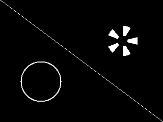

# nano-gpu
An educational SystemVerilog project to learn and explore the fundamentals of GPU design through a simple, compact implementation.

## Overview

nano-gpu is comprised of the following sub-modules:

* gpu_top: top level module, contains the following
* command_decoder: decodes a GPU instruction
* geometry_unit: converts high-level primitives into pixel coordinates
* rasterizer: converts x y coordinates into frame buffer writes
* frame_buffer: virtual frame buffer in lieu of a VGA adapter which will come in future implementations

The first and currently only supported instruction is to draw a line.
Given an input command which encodes OPCODE (draw line), X1, Y1, X2, Y2 coordinates, and COLOR, the data and control flows as follows:

command -> command_decoder -> geometry_unit -> rasterizer -> frame_buffer

## Running

The Makefile targets require the following tools and has been tested on MacOS:

* Icarus Verilog for simulation
* GTKWave for waveform viewing
* Yosys for synthesis, place and route, etc

The following examples focus on the rasterizer block. Similar targets are available for the other blocks.

Simulating and viewing waveforms:

```make rast```

Viewing RTL diagram:

```make rast_rtl_view```

Synthesizing:

```make rast_synth```

A clean house is a happy house:

```make clean```

## Additional Tools

* frame_buffer_viz.py: Render frame buffer contents as a 320 by 240 grayscale image, such as


